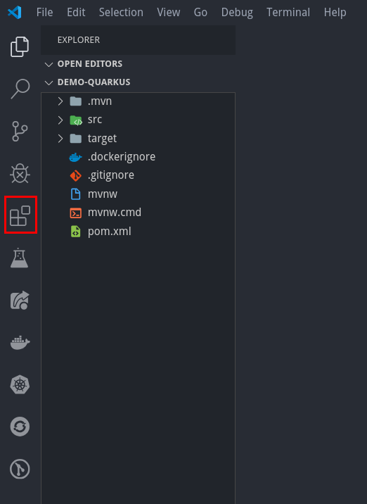
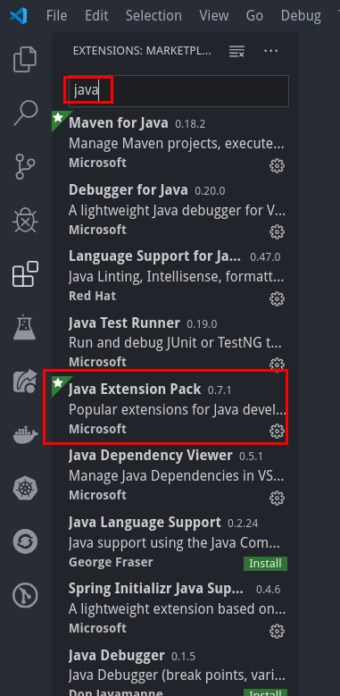
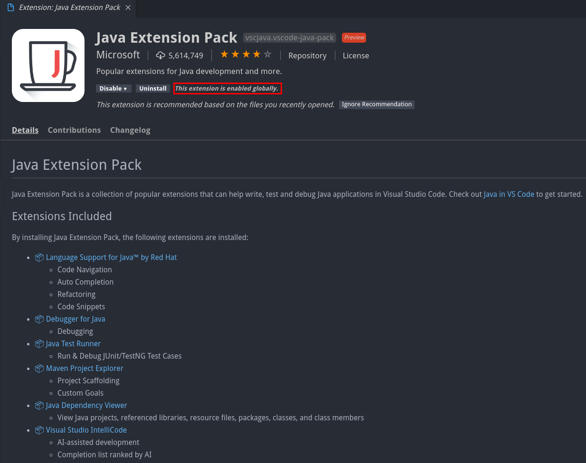

# Quarkus Demo

This demo is based on Burr Sutter presentation on Voxxed Days.

## Pre-req

* VSCode and Java plugin pack installed
* Postgres
* Pgadmin3

## To demo

* Open Brave
* Run Postgresql
* Open terminal
* Open pgadmin3 

### VSCode

To install vscode, open [the oficial page](https://code.visualstudio.com/download) and follow the instructions.

### Postgresql

To create a database to this demo, we'll use `podman` but you can also use `docker` if you like it.

```bash
podman run -p 5432:5432 -e POSTGRES_USER=admin -e POSTGRES_PASSWORD=redhat -e POSTGRES_DB=todo postgres:11
```

If everything worked as expected, you should see that your database is ready to accept connections.


### Pgadmin3

To install pgadmin3, use your favority package manager. If you are using fedora, just run:

```bash
sudo dnf install pgadmin3
```

You can also follow the [oficial docs](https://www.pgadmin.org/download/).

## Demo

### Creating our first app on Quarkus

Let's created our first quarkus application. For this, run:

```bash
# Create a directory for this demo
mkdir /tmp/demo-quarkus && cd /tmp/demo-quarkus

# Create our app
mvn io.quarkus:quarkus-maven-plugin:0.21.1:create
```

We will be asked for filling some information about group-id, artifact-id, etc.

```bash
Set the project groupId [org.acme.quarkus.sample]: com.redhat.quarkusdemo
Set the project artifactId [my-quarkus-project]: quarkus
Set the project version [1.0-SNAPSHOT]: <hit enter>
Do you want to create a REST resource? (y/n) [no]: y
Set the resource classname [com.redhat.demoquarkus.HelloResource]: <hit enter>
Set the resource path  [/hello]: <hit enter>
```

Now if we list all files in our dir, we should have:


Let's open this code on VSCode.

```bash
code .
```

### Showing Java Pack Extension for VSCode

Before moving on with our demo, you can check if your `java pack extension` is installed. Click on `Extensions` icon.



Then search for `java`:



And make sure it is installed.



### Opening VSCode integrated terminal

Press ``Ctrl + ` `` to open vscode integrade terminal. Or, if you prefer, click on `View` -> `Terminal`. Your screen should be like this


### Open our hello REST endpoint

Open the Hello REST endpoint.


### Hot Reload

Let's run our quarkus app. On your integrated terminal, run

```bash
mvn compile quarkus:dev
```

You should see something like this


> Notice the time that was necessary to start. Super fast and we are not using native mode yet.

Now open your browser on `http://localhost:8080/hello`


Change the hello method to return something else.

```java
package com.redhat.demoquarkus;

import javax.ws.rs.GET;
import javax.ws.rs.Path;
import javax.ws.rs.Produces;
import javax.ws.rs.core.MediaType;

@Path("/hello")
public class HelloResource {

    @GET
    @Produces(MediaType.TEXT_PLAIN)
    public String hello() {
        return "hello from quarkus";
    }
}
```

Save your file and refresh your browser.


Now you have an app that reload as fast as you would have when using a nodejs application.

### Testing our endpoint

Let's test our endpoint. For that, open `HelloResourceTest.java`.


Then, click on `Run Test`.


Your test should not pass on the test because our body content was changed on our endpoint but not in our test.

> If for some reason you find an error like `Error: No delegateCommandHandler for vscode.java.checkProjectSettings`, then restart your vscode and you are good to go.


Change the test body content according to our endpoint.

```java
    @Test
    public void testHelloEndpoint() {
        given()
          .when().get("/hello")
          .then()
             .statusCode(200)
             .body(is("hello from quarkus"));
    }
```

Now, run again our test and you should have passed on our endpoint test.


Now, stop your code by pressing `Ctrl` + `C` inside the integrated terminal.

### Adding extensions

To list all avaiable extensions, run

```bash
# For maven
mvn quarkus:list-extensions
# or for gradle
gradle list-extensions
```

Let's add hibernate panache, jsonb and mariadb extensions

```bash
mvn quarkus:add-extension -Dextensions=quarkus-hibernate-orm-panache,quarkus-resteasy-jsonb,quarkus-jdbc-postgresql
```


If you look at you pom.xml, you will see this last command added some new dependencies for us.


So, let's run again our application.

```bash
mvn compile quarkus:dev
```

### Creating Todo Entity

Create a new entity inside our `demoquarkus` folder.


Now, we need to add some JPA annotations and also extends our class from PanacheEntity.


For now, let's just add a single field named `title` to our entity.


Here is our entity

```java
package com.redhat.demoquarkus;

import javax.persistence.Entity;

import io.quarkus.hibernate.orm.panache.PanacheEntity;

/**
 * Todo
 */
@Entity
public class Todo extends PanacheEntity {
    public String title;
}
```

### Connecting to a database

Open `application.properties` and paste the following content:

```properties
quarkus.datasource.url = jdbc:postgresql://localhost:5432/todo
quarkus.datasource.driver = org.postgresql.Driver
quarkus.datasource.username = admin
quarkus.datasource.password = redhat
quarkus.hibernate-orm.database.generation=drop-and-create
#quarkus.hibernate-orm.database.generation=update
quarkus.hibernate-orm.log.sql=true
```

> Update this variable according to your environment.


#### Creating a connection on Pgadmin3


#### Checking your database


Now, let's refresh our page on the browser.


If we look now at our database, quarkus should already created a new table. You can check this out using


We need to add some more fields to our entity. Let's do that.


The final entity should look like this

```java
package com.redhat.demoquarkus;

import javax.persistence.Column;
import javax.persistence.Entity;

import io.quarkus.hibernate.orm.panache.PanacheEntity;

/**
 * Todo
 */
@Entity
public class Todo extends PanacheEntity {
    public String title;
    public boolean completed;
    @Column(name = "ordering")
    public int order;
}
```

> We have changed our column name for the field `order` because it may conflict with some reserved words used by the database.

### Syntax Errors

Let's say that we forgot to add the semi-colon in the end of our entitys last line.

```java
...
public class Todo extends PanacheEntity {
    public String title;
    public boolean completed;
    @Column(name = "ordering")
    public int order
}
```

Now, open our browser and let's see how quarkus handle this kind of situation. Refresh your page.


Correct your code, and hit refresh one more time.

If we look again for our database, we should see new columns.


### Creating our todo resource

Create a new file `TodoResource.java`.


Now, let's make it a REST endpoint adding some annotations to it.


In the end, you should have this

```java
package com.redhat.demoquarkus;

import javax.ws.rs.Consumes;
import javax.ws.rs.Path;
import javax.ws.rs.Produces;
import javax.ws.rs.core.MediaType;

/**
 * TodoResource
 */
@Path("/todo")
@Consumes(MediaType.APPLICATION_JSON)
@Produces(MediaType.APPLICATION_JSON)
public class TodoResource {

    
}
```

We need to get all our todo items. For that, we are going to create a new method inside our `TodoResource`.


Your get method should looks like this

```java
package com.redhat.demoquarkus;

import java.util.List;

import javax.ws.rs.Consumes;
import javax.ws.rs.GET;
import javax.ws.rs.Path;
import javax.ws.rs.Produces;
import javax.ws.rs.core.MediaType;

/**
 * TodoResource
 */
@Path("/todo")
@Consumes(MediaType.APPLICATION_JSON)
@Produces(MediaType.APPLICATION_JSON)
public class TodoResource {

    @GET
    public List<Todo> getAll() {
        return Todo.listAll();
    }
}
```

### Creating our todo app

When we open `http://localhost:8080` we can see this page.


In the bottom of the page, it says how we can change this page. Let's do that.

```bash
rm -rf src/main/resources/META-INF/resources/index.html
```

Copy the content of `todomvc` folder to `src/main/resources/META-INF/resources/`.

```bash
cp -r /home/gustavo/github/quarkus-demo/todomvc/* src/main/resources/META-INF/resources/
```

Open `http://localhost:8080/todo.html` to see if it is working properly.


### Adding POST method

Now add the POST method below `getAll`.

```java
...
    @POST
    @Transactional
    public Response create(Todo item){
        item.persist();
        return Response.ok(item).status(201).build();
    }
```

Save your work and test the todo app.


Check your database.


### Adding DELETE and PATCH method

```java
...
    @DELETE
    @Transactional
    @Path("/{id}")
    public Response deleteOne(@PathParam("id") Long id) {
        Todo entity = Todo.findById(id);
        entity.delete();

        return Response.status(204).build();
    }

    @PATCH
    @Transactional
    @Path("/{id}")
    public Response update(Todo item, @PathParam("id") Long id) {
        Todo entity = Todo.findById(id);
        entity.id = item.id;
        entity.title = item.title;
        entity.completed = item.completed;
        entity.order = item.order;

        return Response.status(200).build();
    }
```

The final TodoResource should look like this

```java
package com.redhat.quarkusdemo;

import java.util.List;

import javax.transaction.Transactional;
import javax.ws.rs.Consumes;
import javax.ws.rs.DELETE;
import javax.ws.rs.GET;
import javax.ws.rs.PATCH;
import javax.ws.rs.POST;
import javax.ws.rs.Path;
import javax.ws.rs.PathParam;
import javax.ws.rs.Produces;
import javax.ws.rs.core.MediaType;
import javax.ws.rs.core.Response;

/**
 * TodoResource
 */
@Path("/todo")
@Produces(MediaType.APPLICATION_JSON)
@Consumes(MediaType.APPLICATION_JSON)
public class TodoResource {

    @GET
    public List<Todo> getAll() {
        return Todo.listAll();
    }

    @POST
    @Transactional
    public Response create(Todo item){
        item.persist();
        return Response.ok(item).status(201).build();
    }

    @DELETE
    @Transactional
    @Path("/{id}")
    public Response deleteOne(@PathParam("id") Long id) {
        Todo entity = Todo.findById(id);
        entity.delete();

        return Response.status(204).build();
    }

    @PATCH
    @Transactional
    @Path("/{id}")
    public Response update(Todo item, @PathParam("id") Long id) {
        Todo entity = Todo.findById(id);
        entity.id = item.id;
        entity.title = item.title;
        entity.completed = item.completed;
        entity.order = item.order;

        return Response.status(200).build();
    }
}
```

Now, change your `application.properties` to only update our database, avoiding to lose data every time we refresh the page.

```properties
quarkus.datasource.url = jdbc:postgresql://localhost:5432/todo
quarkus.datasource.driver = org.postgresql.Driver
quarkus.datasource.username = admin
quarkus.datasource.password = redhat
#quarkus.hibernate-orm.database.generation=drop-and-create
quarkus.hibernate-orm.database.generation=update
quarkus.hibernate-orm.log.sql=true
```

Test your todo app and make sure it is working correctly.

### Bean Validation

Let's update our `Todo` class to avoid blank title.


### OpenAPI and Swagger

We can use swagger in out API. For that, we need to add a new extension:

```bash
mvn quarkus:add-extension -Dextensions="quarkus-smallrye-openapi"
```

Restart quarkus and then open `http://localhost:8080/swagger-ui/`


Now you can test all the four CRUD operations using swagger-ui.


### Health Check

```bash
mvn quarkus:add-extension -Dextensions="quarkus-smallrye-health"
```

Restart your quarkus and open `http://localhost:8080/health` to see your health check.


### Tracing

### Packaging our app

#### JVM

```bash
# Package
mvn package -DskipTests

# Run it
java -jar target/quarkus-1.0-SNAPSHOT-runner.jar
```

Test your todo app

Get java PID:

```bash
JAVA_DEMO_PID=$(ps aux | grep quarkus | awk '{ print $2}' | head -1)
```

Now check how much resource it's been used by this java process:

```bash
ps -o pid,rss,cmd -p $JAVA_DEMO_PID | awk 'NR>1 {$2=int($2/1024)"M";}{ print;}'
```

#### Native

```bash
./mvnw package -Pnative -Dnative-image.container-runtime=docker -DskipTests
```